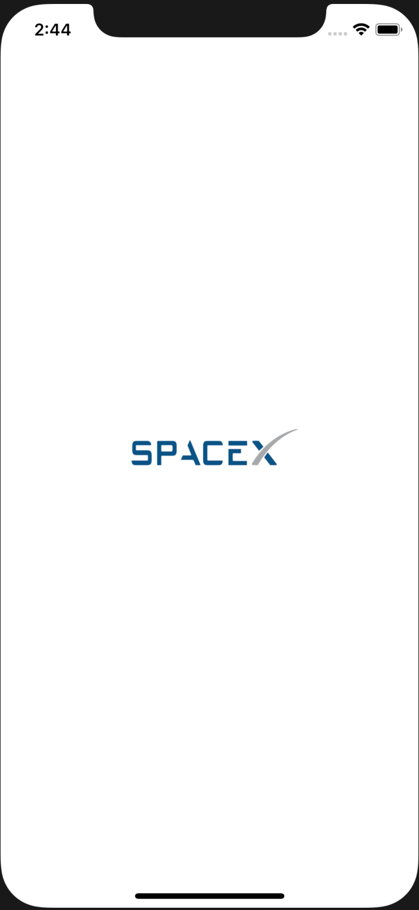

# SpaceX
A simple Master-Detail app showing a list of SpaceX launches.

    
    
    

## Preview

    
    
    
    

## Usage

To run the app, it is simple

1. Download and extract the zip
2. Open the workspace with xcode
    - No need to run **\"pod install\"**
    - The `pod` diectory is tracked
3. `cmd+Shift+K` to clean then `cmd+R` to run

## Requirement

- Swift 5.1
- iOS 11.0 and above

## Architecture

This app is based on a simple Master-Detail architecture :

* The master view controller is a `UITableViewController` subclass which lists all spaceX launches with the possibility to filter and sort them.

* The detail view controller is a `UIViewController` subclass which displays the details about the selected launch and it's rocket.

The filter view controller is a `UIViewController` subclass which is presented through a custom controller transition animation called `CircularTransition`. 

It's possible to show the rocket's wikipedia page from the detail view controller in two different ways :

* Open the link in Safari when it is possible otherwise an alert will be shown indicating that it is not possible to open the requested link.
* Open the link in-App in a `UIViewController` subclass with a `WKWebView` as view. It is a small and simple in-app browser.

## Design pattern

This app uses the classic Apple's MVC pattern.

## Discussion

I used only one third-party library which is `Alamofire` because it helps enormously taking care of API calls. 

I have made the choice to target only iPhone devices in portrait mode because it is an exercise and it is not an app that will be published. For the same reason i have not written unit and UI tests but the targets exist.

I picked few information to display about the launch and the rocket thinking it is enought relevant for a any user but i do not belong to this activity area.

The initial list of launches is shown without any sort and it is paginated. The number of launches per page is `50`. Once the user scrolls down to the bottom of the screen the next page is fetched. This process is repeated until there is not more data to fetch.

The app is localized and supports both English and French.